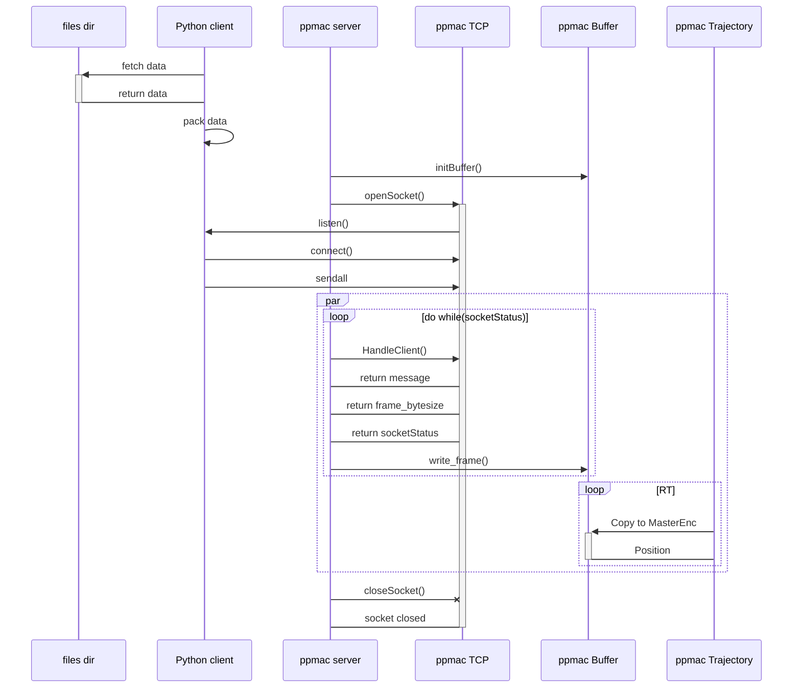

```mermaid
sequenceDiagram

    participant files dir
    participant Python client
    participant ppmac server
    participant ppmac TCP
    participant ppmac Buffer
    participant ppmac Trajectory

    Python client ->>+ files dir: fetch data
    files dir ->- Python client: return data
    Python client ->> Python client: pack data

    ppmac server ->> ppmac Buffer: initBuffer()

    ppmac server ->>+ ppmac TCP: openSocket()
    ppmac TCP ->> Python client: listen()
    Python client ->> ppmac TCP: connect()
    Python client ->> ppmac TCP: sendall

    par
        loop do while(socketStatus)
            ppmac server ->> ppmac TCP: HandleClient()
            ppmac TCP -> ppmac server: return message
            ppmac TCP -> ppmac server: return frame_bytesize
            ppmac TCP -> ppmac server: return socketStatus
            ppmac server ->> ppmac Buffer: write_frame()
        end
        loop RT
            ppmac Trajectory ->>+ ppmac Buffer: Copy to MasterEnc
            ppmac Buffer ->- ppmac Trajectory: Position
        end
    end

    ppmac server -x ppmac TCP: closeSocket()
    ppmac TCP ->- ppmac server: socket closed
```